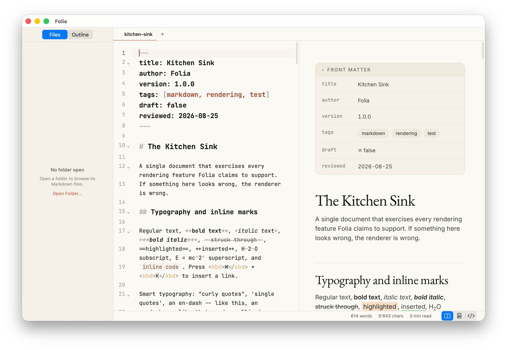
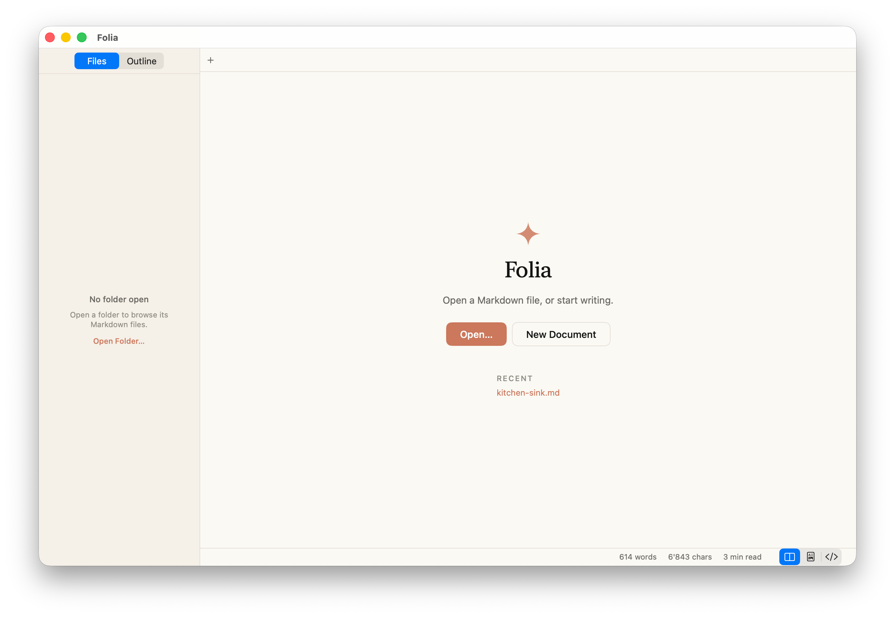
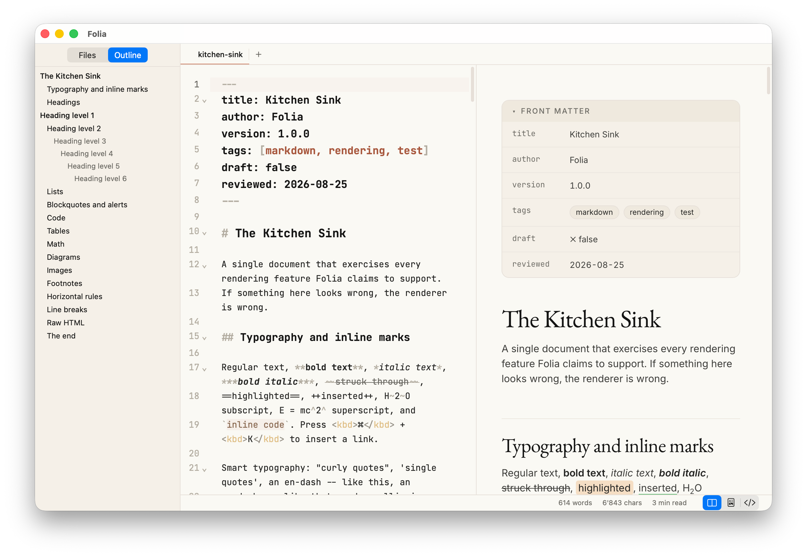

# Folia

A fast, good-looking Markdown reader and editor for macOS — a native app, not
a wrapper around a text field. Split-pane editing with a live preview, a
folder sidebar for browsing a whole vault of notes, and export to HTML, PDF,
TextBundle or rich text, all running completely offline.

A warm, editorial look — cream canvas, serif headings, coral accents — instead
of the generic dark-mode-IDE aesthetic most Markdown apps default to.



## Get it running

You need Xcode's Command Line Tools and Node — **not** full Xcode.

```bash
git clone https://github.com/hmuyal/Folia.git
cd Folia
./build.sh
open Folia.app
```

That's it. `build.sh` builds the web bundle, compiles the Swift app, generates
the icon and signs it ad-hoc — it produces a working `Folia.app` right there
in the folder. Drag it into `/Applications` to keep it, and it'll register
itself as a handler for Markdown files, so double-click, Open With and
dragging a `.md` file onto its Dock icon all just work.

Since it's built locally and not notarised, the first launch will get a
Gatekeeper warning — right-click the app and choose **Open** once to clear it.



## What it does

**Reads** — CommonMark + GFM plus a broad set of popular extensions:
`==highlight==`, `~sub~`, `^sup^`, `++ins++`, footnotes, definition lists,
abbreviations, emoji shortcodes, heading anchors, YAML front matter rendered
as a metadata card, math via KaTeX, Mermaid diagrams, syntax-highlighted code
in 49 languages, GitHub alerts (`> [!NOTE]`), `:::` containers, and optional
`[[wiki links]]`.

**Browses** — open a folder in the sidebar and switch or close it from the
footer control at its base, or from File › Open Folder / Open Recent Folder /
Close Folder. Closing a folder leaves your open documents alone.

**Edits** — a CodeMirror 6 source pane with Markdown-aware highlighting,
scroll-synced live preview, formatting shortcuts, smart list continuation,
find & replace, paste-HTML-as-Markdown, and drag-or-paste images that get saved
beside the document.

**Exports** — self-contained HTML (fonts and images inlined, opens with no
network), paginated PDF with element-aware page breaks, TextBundle, Print, and
copy-as-rich-text that pastes correctly into Mail, Pages and Slack.

**Stays offline** — KaTeX, Mermaid, highlight.js and every font ship inside the
app. A document renders completely with the network unplugged, and remote
content is blocked unless you turn it on.



## Keyboard shortcuts

| | |
|---|---|
| ⌘N / ⌘O / ⌘S / ⇧⌘S | New · Open · Save · Save As |
| ⇧⌘O | Open folder in the sidebar |
| ⌘W | Close tab |
| ⇧⌘] / ⇧⌘[ | Next / previous tab |
| ⌘B / ⌘I / ⌘K / ⌘E | Bold · Italic · Link · Inline code |
| ⇧⌘X / ⇧⌘E | Strikethrough · Code block |
| ⌘1–⌘6 / ⌘0 | Heading level · body text |
| ⇧⌘L / ⌥⌘L / ⇧⌘' | Bulleted · numbered list · blockquote |
| ⌘F / ⌥⌘F | Find · find and replace |
| ⇧⌘P / ⇧⌘F | Quick open · find in folder |
| ⌘\ | Toggle reader mode |
| ⌃⌘S | Toggle sidebar |
| ⌥⌘+ / ⌥⌘- / ⌥⌘0 | Zoom preview in · out · reset |
| ⇧⌘R | Reveal in Finder |

## Building

Options for `build.sh`:

| Flag | Effect |
|---|---|
| `--debug` | Debug configuration — faster to compile |
| `--run` | Launch when the build finishes |
| `--skip-web` | Reuse the existing web bundle |
| `--universal` | Build arm64 + x86_64 |

### Verifying a build

```bash
./Folia.app/Contents/MacOS/Folia --selftest samples/kitchen-sink.md
```

This boots the real WebView headlessly, serves the real bundle over the app's
private URL scheme, pushes a document through the real bridge, then inspects the
resulting DOM, the HTML export and the generated PDF. 25 checks; exits non-zero
if anything regressed.

To iterate on rendering without rebuilding the app:

```bash
cd web && node build.mjs && python3 -m http.server 8731 --directory dist/web
```

then open `http://localhost:8731/harness.html` (add `?theme=dark`).

## Architecture

```
Swift / AppKit + SwiftUI          window · menus · tabs · sidebar
                                  file I/O · watching · export · prefs
   │
   └── one WKWebView              CodeMirror 6 │ splitter │ rendered preview
                                  markdown-it · KaTeX · Mermaid · highlight.js
```

Swift owns the filesystem; the page never sees a `file://` URL. Everything the
WebView loads arrives over a private `folia://` scheme whose handler serves the
app bundle and the current document's folder, and nothing else.

The renderer lives in JavaScript deliberately: markdown-it has all of these
extensions available as maintained plugins, rather than needing custom patches
to a native parser.

| Path | What |
|---|---|
| `web/src/render/` | markdown-it pipeline and its plugins |
| `web/src/preview/` | sanitising, Mermaid, breakout measuring, the Preview class |
| `web/src/editor/` | CodeMirror setup, theme, commands, paste handling |
| `web/styles/` | design tokens, document theme, editor theme, shell |
| `Sources/Folia/` | the app: models, services, bridge, views |

One thing is declared in more than one place and so is guarded by a build-time
check:

| Duplicated | Guard |
|---|---|
| Render options — `web/src/render/options.js` and `RenderOptions` in `Preferences.swift`, which are serialised into each other | `Tools/check-options-parity.mjs` — 32 keys |

Design tokens are also declared twice (see below) and guarded the same way.
Both checks run inside `build.sh` and fail the build on drift.

## Design

The tokens live in `web/styles/tokens.css` and are the source of truth for the
document; they're mirrored in `Sources/Folia/Design/Tokens.swift` for native
chrome. `Tools/check-design-tokens.mjs` runs during `build.sh` and fails the
build if any colour, radius or spacing value drifts between the two files.

A few decisions worth knowing about:

- **Code blocks are dark in both themes.** The `code-window-card` is the
  signature element of the system, so it keeps its `#181715` surface on the
  cream canvas.
- **Links use `#a9583e`, not the brand `#cc785c`.** Coral on cream measures
  3.11:1, below WCAG AA for body text; the darker coral measures 4.80:1. The
  brand coral is still used for buttons, badges, rules and callout fills, where
  it is not running text. Links are always underlined.
- **Prose holds a 760px measure**, not the spec's 1200px marketing container.
  Code, tables and diagrams break out to 1100px — but only when their content
  actually overflows, so a narrow table stays aligned with the paragraph that
  introduces it.
- **`---` renders as the Anthropic four-spoke mark**, which the spec names as a
  content marker.
- **PDF pages break between blocks, never through them.** `PDFRenderer` measures
  the laid-out document, picks break points that keep a code window, table or
  diagram whole, captures one slice per page with `createPDF`, and composes them
  onto Letter pages. A block taller than a page is the only thing that gets cut.
- **Headings split serif to sans at h4**, following the spec's own
  Copernicus-for-display, StyreneB-for-titles division.
- **Native chrome uses the system font.** EB Garamond, Inter and JetBrains Mono
  ship as woff2, which CoreText cannot load; SF Pro is the right face for Mac
  menus and toolbars anyway. Drop `.otf`/`.ttf` files into `Resources/Fonts/`
  and `FontRegistrar` will pick them up.

## Security

The app renders untrusted files, so:

- HTML is rendered but sanitised with DOMPurify — scripts, event handlers and
  unsafe URLs are stripped. This is what GitHub does. Both halves are separately
  switchable in Settings › Security.
- A CSP restricts the page to the `folia:` origin.
- A document's relative links and images (`folia://doc/...`), and `~/`-relative
  ones (`folia://home/...`), are resolved and then checked to make sure the
  result didn't walk out of the document's folder or your home directory with
  a `../` — a document can't use that to read files elsewhere on disk.
- Remote content is off by default.
- `http(s)` links open in your browser; `javascript:` and `file:` are refused.
- The app is not sandboxed — it has no signing identity and needs free file
  access.

## Known limits

- **No Quick Look extension.** App extensions require full Xcode. Folia
  registers as a handler for Markdown files so double-click and Open With work,
  but it does not render Quick Look previews.
- **Not notarised.** Locally built and ad-hoc signed. Gatekeeper will warn if
  you move the app to another machine.
- **KaTeX, not MathJax.** Synchronous and much smaller. It covers essentially
  all Markdown maths, though MathJax handles a few more obscure edge cases.
- **Print… is the one path not covered by the self-test.** It uses the system
  print dialog via `NSPrintOperation`, which deadlocks whenever the app is not
  visible and active — so it cannot be driven headlessly. Export as PDF does not
  touch the print subsystem at all and is fully tested; Print refuses rather
  than hanging if there is no visible window.

## Licence

MIT — see [`LICENSE`](LICENSE).

The bundled typefaces (EB Garamond, Inter, JetBrains Mono) are SIL Open Font
License. Third-party JavaScript keeps its own licences; see `web/package.json`.

## Support

If you find Folia useful, consider [buying me a coffee](https://buymeacoffee.com/hervem).

[](https://buymeacoffee.com/hervem)

<a href="https://buymeacoffee.com/hervem"></a>
