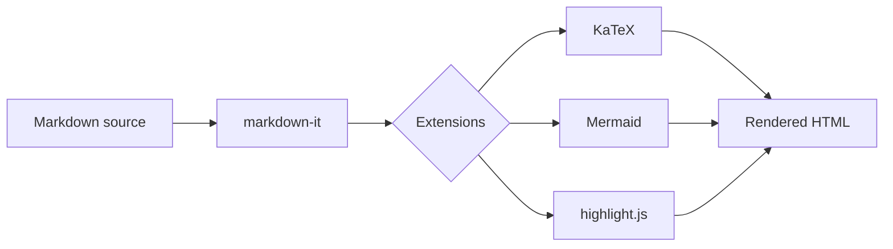
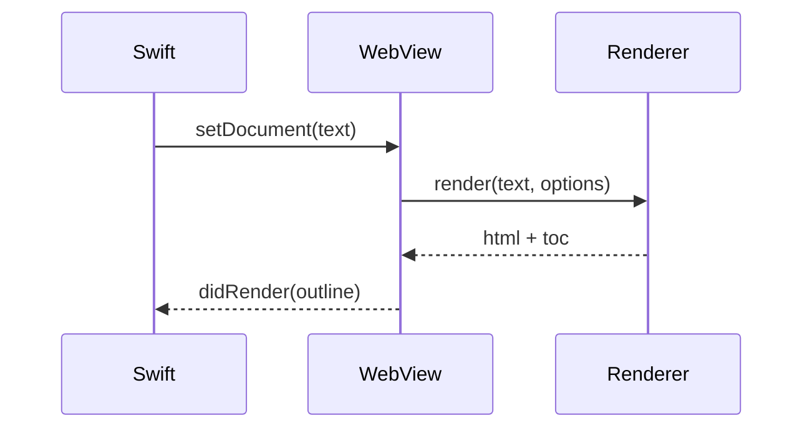
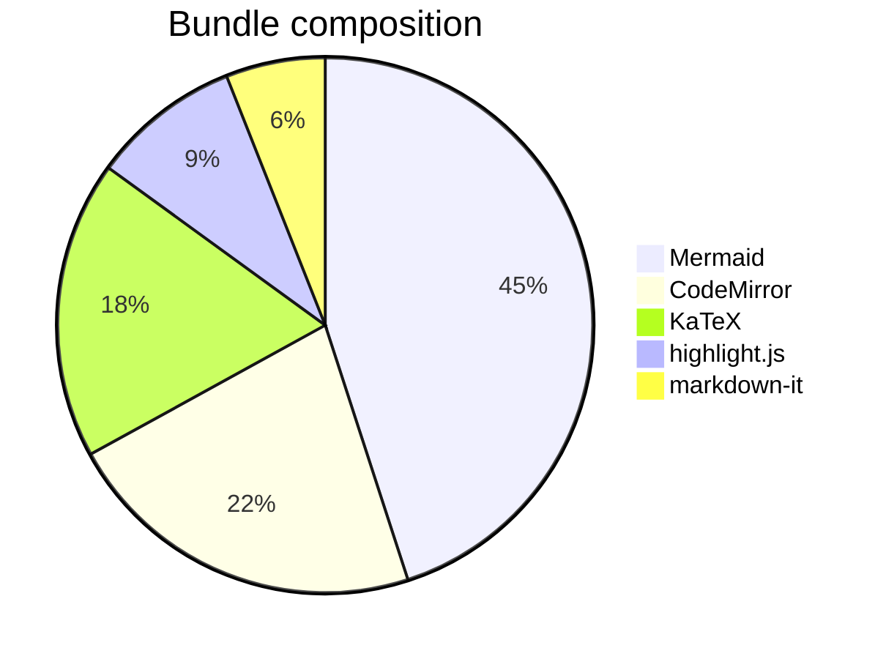

# The Kitchen Sink

A single document that exercises every rendering feature Folia claims to support.
If something here looks wrong, the renderer is wrong.

## Typography and inline marks

Regular text, **bold text**, *italic text*, ***bold italic***, ~~struck through~~,
==highlighted==, ++inserted++, H~2~O subscript, E = mc^2^ superscript, and
`inline code`. Press <kbd>⌘</kbd> + <kbd>K</kbd> to insert a link.

Smart typography: "curly quotes", 'single quotes', an en-dash -- like this, an
em-dash --- like that, and an ellipsis...

An abbreviation is defined at the bottom of this section, so HTML should carry
a dotted underline and reveal its expansion on hover.

*[HTML]: HyperText Markup Language

Emoji shortcodes: :rocket: :sparkles: :warning: :white_check_mark: :books:

Autolinks: https://www.markdownguide.org and hello@example.com.

A [regular link](https://example.com), an [internal link](./other.md), and a
[section link](#tables).

## Headings

# Heading level 1
## Heading level 2
### Heading level 3
#### Heading level 4
##### Heading level 5
###### Heading level 6

## Lists

Unordered:

- First item
- Second item
  - Nested item
  - Another nested item
    - Third level
- Third item

Ordered:

1. First
2. Second
   1. Nested ordered
   2. Second nested
3. Third

Task list:

- [x] Design the token system
- [x] Build the renderer
- [ ] Wire up the editor
- [ ] Ship it

Definition list:

Markdown
: A lightweight markup language for writing structured text.

CommonMark
: A strongly specified, highly compatible implementation of Markdown.

## Blockquotes and alerts

> A plain blockquote. It should read as a soft cream card with a hairline rule,
> not as a coral element — coral stays scarce.
>
> Second paragraph inside the quote.

> [!NOTE]
> Useful information that users should know, even when skimming content.

> [!TIP]
> Helpful advice for doing things better or more easily.

> [!IMPORTANT]
> Key information users need to know to achieve their goal.

> [!WARNING]
> Urgent info that needs immediate user attention to avoid problems.

> [!CAUTION]
> Advises about risks or negative outcomes of certain actions.

::: tip Container syntax
This alert came from a `:::tip` fenced container rather than a blockquote.
:::

## Code

Inline `const x = 42;` and a fenced block:

```swift
import SwiftUI

/// A view that renders Markdown with the app's design tokens.
struct DocumentView: View {
    @State private var text: String = ""
    let tokens = DesignTokens.shared

    var body: some View {
        SplitView {
            Editor(text: $text)
            Preview(html: render(text))
        }
        .background(Color(hex: 0xfaf9f5))
    }
}
```

```python
def fibonacci(n: int) -> list[int]:
    """Return the first n Fibonacci numbers."""
    seq = [0, 1]
    while len(seq) < n:
        seq.append(seq[-1] + seq[-2])
    return seq[:n]

print(fibonacci(10))  # [0, 1, 1, 2, 3, 5, 8, 13, 21, 34]
```

```javascript
const render = (src, opts = {}) => {
  /* A multi-line comment
     that spans several lines
     to test the line-splitting logic. */
  const md = new MarkdownIt({ html: false, linkify: true });
  return md.render(src);
};
```

```json
{
  "name": "folia",
  "version": "1.0.0",
  "private": true,
  "nested": { "array": [1, 2, 3], "bool": true, "null": null }
}
```

```bash
#!/usr/bin/env bash
set -euo pipefail
swift build -c release --arch arm64
codesign --force --sign - "Folia.app"
```

```sql
SELECT d.title, COUNT(*) AS revisions
FROM documents d
JOIN revisions r ON r.document_id = d.id
WHERE d.updated_at > NOW() - INTERVAL '30 days'
GROUP BY d.title
ORDER BY revisions DESC;
```

```
A fenced block with no language tag at all.
It should still render in the dark code window.
```

## Tables

| Token | Value | Usage |
|---|---|---|
| `canvas` | `#faf9f5` | Default page floor |
| `primary` | `#cc785c` | Primary CTA, callout fills |
| `ink` | `#141413` | Headlines and primary text |
| `surface-dark` | `#181715` | Code windows, footer |

Alignment:

| Left | Center | Right |
|:-----|:------:|------:|
| a | b | 1 |
| longer cell | centered | 1000 |

A deliberately wide table that must scroll rather than wrap:

| Component | Background | Text | Radius | Padding | Height | Typography | Notes |
|---|---|---|---|---|---|---|---|
| `button-primary` | `#cc785c` | `#ffffff` | 8px | 12px 20px | 40px | StyreneB 14/500 | The signature coral CTA |
| `feature-card` | `#efe9de` | `#141413` | 12px | 32px | auto | StyreneB 18/500 | Used in 3-up grids |
| `code-window-card` | `#181715` | `#faf9f5` | 12px | 24px | auto | JetBrains Mono 14/400 | Shows real product chrome |

## Math

Inline math: the mass-energy equivalence $E = mc^2$, and Euler's identity
$e^{i\pi} + 1 = 0$.

Display math:

$$
\int_{-\infty}^{\infty} e^{-x^2}\,dx = \sqrt{\pi}
$$

$$
\begin{aligned}
\nabla \cdot \mathbf{E} &= \frac{\rho}{\varepsilon_0} \\
\nabla \cdot \mathbf{B} &= 0 \\
\nabla \times \mathbf{E} &= -\frac{\partial \mathbf{B}}{\partial t}
\end{aligned}
$$

## Diagrams







## Images

A local relative image:


A missing image, which should degrade gracefully:


## Footnotes

Markdown was created in 2004[^md]. CommonMark arrived later[^cm], and GitHub
Flavored Markdown built on top of it[^gfm].

[^md]: By John Gruber, with input from Aaron Swartz.
[^cm]: A strongly specified variant, first released in 2014.
[^gfm]: Adding tables, task lists, strikethrough and autolinks.

## Horizontal rules

Text above the rule.

---

Text between rules.

***

Text below the rule.

## Line breaks

This line ends with two spaces  
so this should be a hard break.

This line has a backslash\
which is also a hard break.

## Raw HTML

<div align="center">
  <strong>This is raw HTML.</strong> It renders only when "Allow raw HTML" is on.
</div>

<script>alert('this must never execute');</script>

## The end

That is every feature. If the page above reads as a warm cream editorial column
with dark code windows and scarce coral, the design system is applied correctly.
